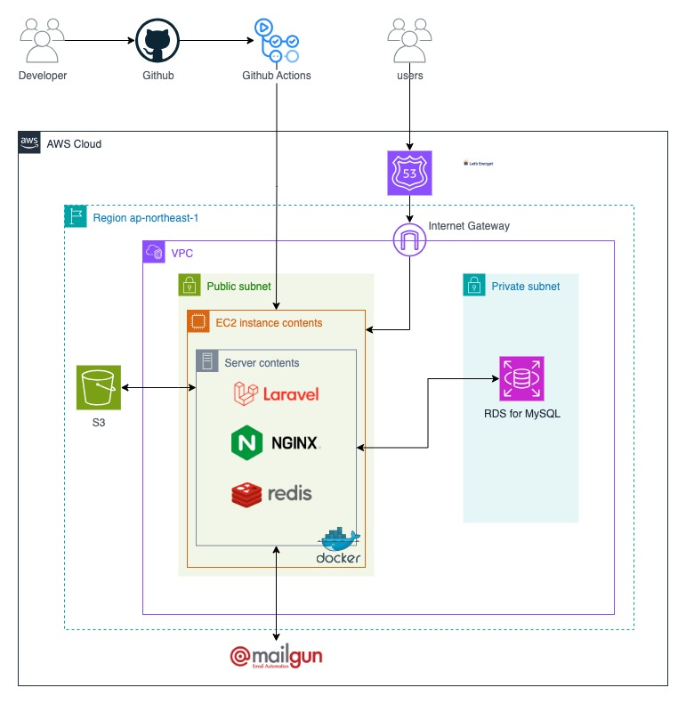

# TRIPOST（トリポスト）

## 概要
「旅の計画も、思い出も。みんなとシェアしよう。」
旅を記録し、他のユーザーの旅からインスピレーションを得られる旅行特化SNSです。
ユーザーは、写真・旅行日程・おすすめ情報などを投稿、共有できます。
また、ユーザーは自身の旅スタイル(ソロ・友達と・バックパッカーなど)や目的(自然・グルメ・リラックスなど)に沿って、他ユーザーの旅を検索することができます。

## URL
[https://mytripost.com](https://mytripost.com)

## 主な利用シーン
【旅行前】
- 旅行先や旅程を決める際に、他のユーザーの投稿を参考にする
- 自分の旅程を作成・整理する
【旅行中】
- リアルタイムに旅の記録を残す
【旅行後】
- 旅の思い出を記録としてまとめる
- 投稿を通して、他のユーザーと旅の体験を共有する

## 機能一覧
- **投稿作成機能**
旅程で登録された場所はマップ上に表示され、それぞれの地点の距離や位置関係を一目で確認可能。
下書き作成、公開範囲設定可能。
- **投稿一覧機能**
全ユーザーの投稿とフォロー中ユーザーの投稿を最新順で表示。
- **投稿検索機能**
フリーワード検索や条件検索(国、時期、旅行スタイルなど)。新着順やいいね順に並び替えも可能。
- **プロフィール機能**
ユーザー名、ユーザー画像、自己紹介文、訪れた国を設定可能。
- **アカウント作成、ログイン機能**
- **メール認証、パスワードリセット機能**
- **いいね機能**
いいねした投稿を一覧で確認可能。
- **フォロー機能**
- **通知機能**

## 使用技術
### フロントエンド
- 言語
JavaScript 
実行環境: Node.js v22.16.0 / npm 11.4.1

- フレームワーク・ライブラリ
React.js 18.3.1  
Inertia.js（クライアント: @inertiajs/inertia 0.11.1、React アダプタ: @inertiajs/react 2.2.0、サーバ: inertiajs/inertia-laravel v2.0.5）  
react-select 5.10.2  
@react-google-maps/api 2.20.7  
react-cropper 2.3.3 / cropperjs 1.6.2  
dayjs 1.11.18  
axios 1.12.2

- ビルド/開発ツール
Vite 7.1.7
laravel-vite-plugin 2.0.1

- UI
Tailwind CSS 3.4.17

- 開発支援
ESLint 9.36.0  
Prettier 3.6.2  

### バックエンド
- 言語
PHP 8.3.22

- フレームワーク・ライブラリ
Laravel Framework 12.23.1
inertiajs/inertia-laravel v2.0.5
laravel/breeze 2.3.8  
laravel/sanctum 4.2.0 
tightenco/ziggy 2.5.3

- テスト / 開発ツール:
phpunit 11.5.32, laravel/pint 1.24.0

### 外部API
Geocoding API
Maps JavaScript API
Places API 
Directions API
[REST Countries](https://restcountries.com/)  

### 開発環境
Docker / Docker Compose（Laravel Sail）
MySQL
Mailpit

### 本番環境
AWS (EC2、RDS for MySQL、Route 53、S3)
Nginx、Redis
Docker / Docker Compose(EC2上)
Mailgun

### CI/CD
Github Actions

### インフラ構成図

