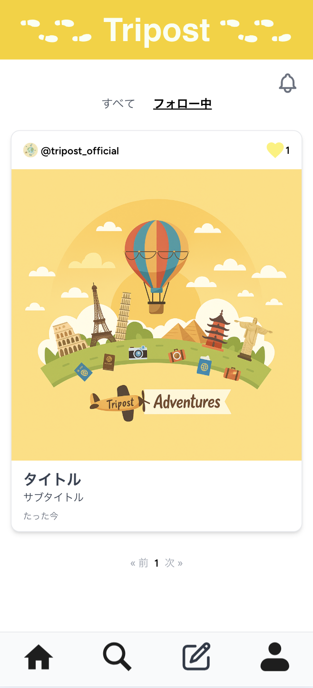
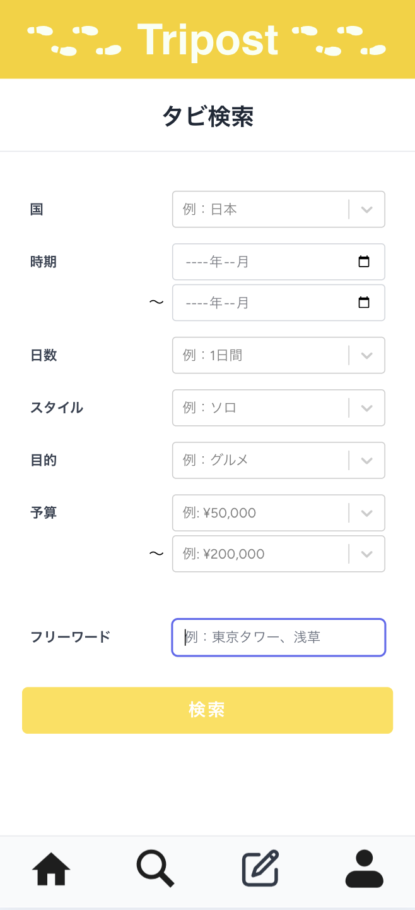
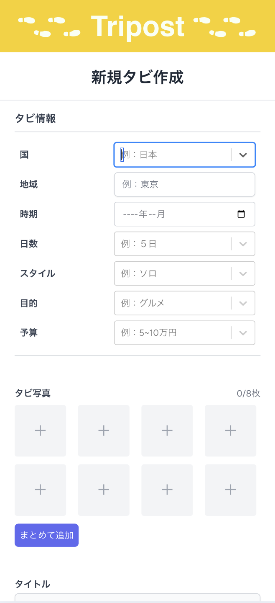
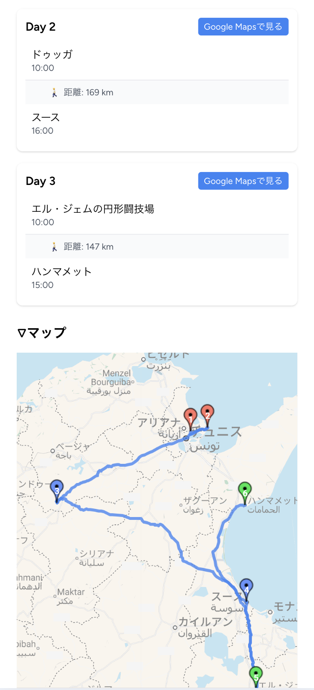
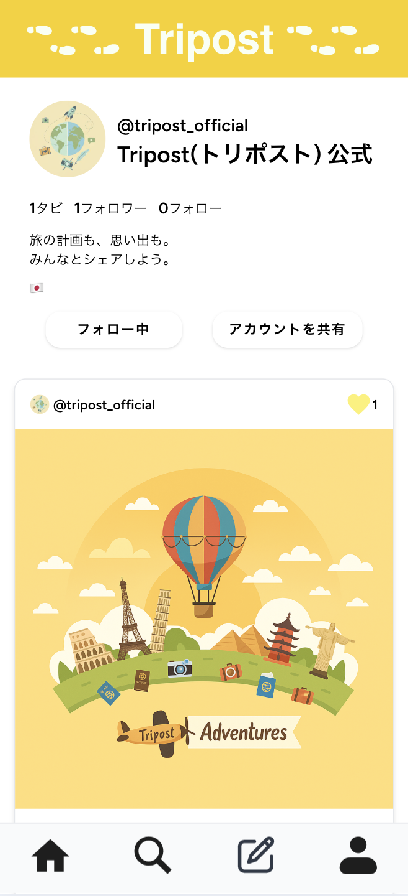
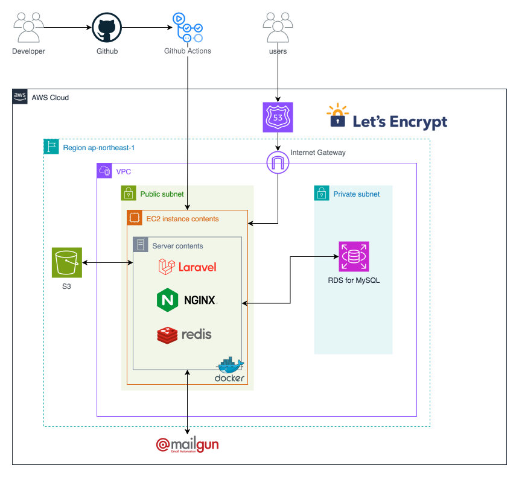
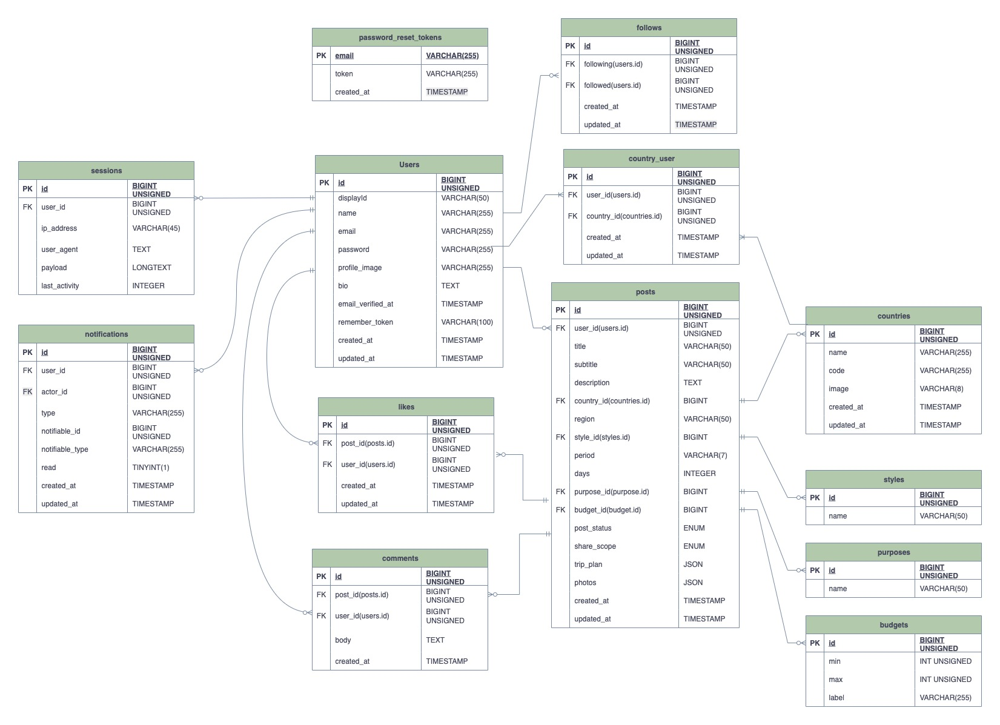

# Tripost（トリポスト）

> 「旅の計画も、思い出も。みんなとシェアしよう。」


[](https://laravel.com)
[](https://react.dev)
[](https://www.php.net)
[](https://aws.amazon.com)
[](https://www.docker.com)
[](https://github.com/features/actions)

**URL:** [https://mytripost.com](https://mytripost.com)

---

## 目次

- [プロダクト概要](#プロダクト概要)
- [開発の背景](#開発の背景)
- [スクリーンショット](#スクリーンショット)
- [機能一覧](#機能一覧)
- [技術スタック](#技術スタック)
- [システム構成図](#システム構成図)
- [ER図](#er図)
- [設計ドキュメント](#設計ドキュメント)
- [ローカル環境のセットアップ](#ローカル環境のセットアップ)
- [工夫した点・こだわり](#工夫した点こだわり)

---

## プロダクト概要

**Tripost** は、旅を記録し、他のユーザーの旅からインスピレーションを得られる **旅行特化型 SNS** です。

InstagramやYouTubeなど既存のSNSでは、旅行情報が「写真・動画・テキスト・地図」と複数プラットフォームに分散しており、自分のスタイルに合った旅行情報を効率よく探すことが困難です。Tripostはこの課題を解決するため、**位置情報・ルート・写真・旅スタイル**を一つの投稿にまとめて共有できる仕組みを提供します。

**主な利用シーン:**

| タイミング | 使い方 |
|---|---|
| 旅行前 | 他ユーザーの投稿を旅スタイル・目的・国などで検索して旅程を計画 |
| 旅行中 | リアルタイムに旅の記録を残す |
| 旅行後 | 投稿としてまとめ、他ユーザーと体験を共有 |

---

## 開発の背景

旅行情報を調べる際、SNS上のUGC（ユーザー生成コンテンツ）を参考にする機会が増えています。しかし実際には以下の課題があります。

1. **情報の断片化** — Instagram・YouTube・ブログなど複数媒体を横断しなければ情報が揃わない
2. **位置情報の不足** — 写真やテキストだけでは場所の特定やルート把握が困難
3. **パーソナライズの欠如** — 自分の旅スタイル（ソロ・バックパッカー・グルメなど）に合った情報が見つかりにくい

これらの課題を解決するために、**旅の情報を一つの投稿に集約し、地図と連動した検索・共有**ができるサービスを個人で開発しました。

---

## スクリーンショット

<div style="display:flex;gap:16px;flex-wrap:wrap;">
  <figure>
    
    <figcaption style="text-align:center;font-size:0.9rem;color:#555;">ホーム画面</figcaption>
  </figure>
  <figure>
    
    <figcaption style="text-align:center;font-size:0.9rem;color:#555;">検索画面</figcaption>
  </figure>
  <figure>
    
    <figcaption style="text-align:center;font-size:0.9rem;color:#555;">投稿作成画面</figcaption>
  </figure>
  <figure>
    
    <figcaption style="text-align:center;font-size:0.9rem;color:#555;">投稿詳細画面</figcaption>
  </figure>
  <figure>
    
    <figcaption style="text-align:center;font-size:0.9rem;color:#555;">プロフィール画面</figcaption>
  </figure>
</div>

---

## 機能一覧

| 機能 | 説明 |
|---|---|
| **投稿作成** | 旅程の各地点をGoogle Mapsと連携して登録。マップ上にマーカー・ルート表示。下書き保存・公開範囲設定に対応 |
| **投稿一覧** | 全ユーザーの投稿・フォロー中ユーザーの投稿を最新順で表示 |
| **投稿検索** | フリーワード・国・旅スタイル・時期などの条件でフィルタリング。新着順/いいね順の並び替えに対応 |
| **いいね** | 投稿へのいいね。いいねした投稿の一覧表示 |
| **フォロー** | ユーザー間のフォロー・フォロワー管理 |
| **通知** | いいね・フォロー時のリアルタイム通知 |
| **プロフィール** | アイコン・自己紹介・訪問国の設定 |
| **認証** | メール認証・パスワードリセット |

---

## 技術スタック

### フロントエンド

| カテゴリ | 技術 |
|---|---|
| 言語 | JavaScript (Node.js v22) |
| フレームワーク | React.js 18 |
| サーバーサイドルーティング | Inertia.js（Laravel アダプタ） |
| 地図 | @react-google-maps/api |
| 画像クロップ | react-cropper / cropperjs |
| スタイリング | Tailwind CSS 3 |
| ビルド | Vite |
| Linter / Formatter | ESLint / Prettier |

### バックエンド

| カテゴリ | 技術 |
|---|---|
| 言語 | PHP 8.3 |
| フレームワーク | Laravel 12 |
| 認証 | Laravel Breeze / Sanctum |
| テスト | PHPUnit |
| Linter | Laravel Pint |

### 外部API

| API | 用途 |
|---|---|
| Google Maps JavaScript API | 地図表示・マーカー配置 |
| Google Places API | 場所検索・Google Mapsとの紐付け |
| Google Directions API | 旅程ルートの表示 |
| Google Geocoding API | 住所 ↔ 座標の変換 |
| REST Countries | 国情報の取得 |

### インフラ・開発環境

| 区分 | 技術 |
|---|---|
| 開発環境 | Docker / Docker Compose（Laravel Sail）、MySQL、Mailpit |
| 本番環境 | AWS (EC2・RDS for MySQL・S3・Route 53)、Nginx、Redis、Mailgun |
| コンテナ (本番) | Docker / Docker Compose（EC2上） |
| CI/CD | GitHub Actions |

---

## システム構成図



---

## ER図



---

## 設計ドキュメント

| ドキュメント | リンク |
|---|---|
| 画面設計図 (Figma) | [Figma - 画面設計](https://www.figma.com/design/JkcWsCKqWOFi29hsUtHpKd/%E5%80%8B%E4%BA%BA%E9%96%8B%E7%99%BA%E3%80%8ETripost%E3%80%8F?node-id=0-1) |
| 画面遷移図 (Figma) | [Figma - 画面遷移](https://www.figma.com/design/JkcWsCKqWOFi29hsUtHpKd/%E5%80%8B%E4%BA%BA%E9%96%8B%E7%99%BA%E3%80%8ETripost%E3%80%8F?node-id=24-435) |
| ユーザーフロー図 (Figma) | [Figma - ユーザーフロー](https://www.figma.com/design/JkcWsCKqWOFi29hsUtHpKd/%E5%80%8B%E4%BA%BA%E9%96%8B%E7%99%BA%E3%80%8ETripost%E3%80%8F?node-id=25-513) |
| API仕様書 | `docs/api.html`（Swagger UI）/ `docs/openapi.yml` |

---

## ローカル環境のセットアップ

### 前提条件

- Docker / Docker Compose がインストール済みであること
- Google Maps Platform の APIキーを取得済みであること

### 手順

```bash
# 1. リポジトリをクローン
git clone https://github.com/sookoo19/Tripost.git
cd Tripost/backend

# 2. 環境変数ファイルを作成
cp .env.example .env

# 3. .env を編集して必要な値を設定
#    - DB_* : データベース接続情報
#    - GOOGLE_MAPS_API_KEY : Google Maps APIキー
#    - MAIL_* : メール送信設定

# 4. Composer パッケージをインストール
docker run --rm -v $(pwd):/app composer install

# 5. Laravel Sail でコンテナを起動
./vendor/bin/sail up -d

# 6. アプリケーションキーを生成
./vendor/bin/sail artisan key:generate

# 7. マイグレーション & シーダーを実行
./vendor/bin/sail artisan migrate --seed

# 8. npm パッケージのインストール & ビルド
./vendor/bin/sail npm install
./vendor/bin/sail npm run dev
```

ブラウザで `http://localhost` にアクセスすると起動確認できます。

---

## 工夫した点・こだわり

### Inertia.js によるSPA体験とサーバーサイドの両立

React × Laravel の構成でSPAのUXを実現しつつ、APIを別途構築せずにLaravelのルーティング・認証・バリデーションをそのまま活用できる Inertia.js を採用しました。フロントエンドとバックエンドを分離せずに開発効率を保ちながら、シームレスなページ遷移を実現しています。

### Google Maps Platform の複数API連携

投稿作成時に Places API で場所を検索・取得し、取得した座標を Maps JavaScript API でマーカー表示、Directions API で各地点間のルートを描画する、3つのAPIを組み合わせた実装を行いました。APIコストを意識しながら、必要なタイミングでのみリクエストを発行するよう設計しました。

### AWS + Docker によるコンテナ本番運用

開発環境と本番環境の差異をなくすため、EC2上でもDocker Composeでコンテナを運用する構成にしました。S3で静的ファイルを管理し、RDSをデータベースに使用することで、スケーラビリティと保守性を確保しています。

### GitHub Actions による CI/CD

mainブランチへのPushをトリガーに、PHPUnit によるテスト・Laravel Pint によるコードスタイルチェック・EC2へのデプロイを自動化するCI/CDパイプラインを構築しました。
